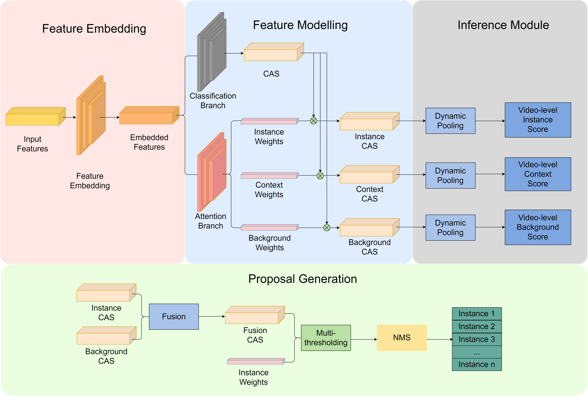

# Weakly-Supervised Temporal Localization with Dynamic Pooling Method

- [Weakly-Supervised Temporal Localization with Dynamic Pooling Method](#weakly-supervised-temporal-localization-with-dynamic-pooling-method)
  - [The Proposed Design](#the-proposed-design)
  - [Pre-extracted Input Features](#pre-extracted-input-features)
  - [How To Run](#how-to-run)
    - [Train the Model](#train-the-model)
    - [Test the Model](#test-the-model)


## The Proposed Design


1.  The feature extraction module extract untrimmed RGB and optical flow features of input videos utilising pre-trained model. 
2.  The modelling module embeds and models the extracted features to its designated feature map and gets three attention weights together with three weighted class activation sequences. 
3.  The inference module performs the multi-instance learning technique to generate the video-level predictions and utilises the multi-thresholding method coupling with non-maximum suppression to obtain the predicted action instance temporal boundaries.

## Pre-extracted Input Features
The utilised pre-extracted features are avaliable [here](https://drive.google.com/file/d/1UqHgEXfHOw-PFUPjwbupUjxFta2d74bO/view?usp=sharing)

## How To Run
1. Download and unzip the pre-extracted input features to root folder
2. Set up the required enviornments as in `requirements.txt`

### Train the Model
```
# For the THUMOS-14 datasets.
python main_thu.py --batch_size 16 --epochs=30

# For the ActivityNet-1.3 datasets.
python main_act.py --batch_size 64 --epochs=50
```

### Test the Model
```
# For the THUMOS-14 datasets.
python main_thu.py --test --checkpoint $checkpoint_path

# For the ActivityNet-1.3 datasets.
python main_act.py --test --checkpoint $checkpoint_path
```
